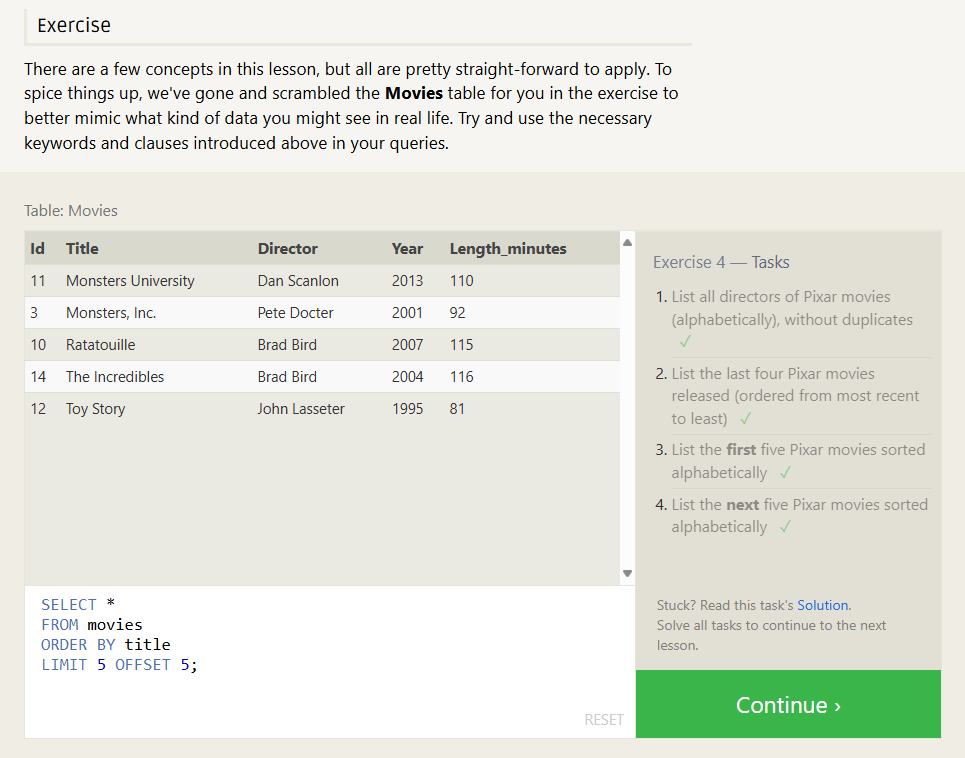

# Exercise 1 — Tasks

1.1. Find the title of each film

```sql
   SELECT title
   FROM Movies;
```

1.2. Find the director of each film

```sql
   SELECT director
   FROM Movies;
```

1.3. Find the title and director of each film

```sql
SELECT title, director
FROM movies;
```

1.4. Find the title and year of each film

```sql
SELECT title, year
FROM movies;
```

1.5. Find all the information about each film

```sql
SELECT *
FROM movies;
```


# Exercise 2 — Tasks

2.1. Find the movie with a row id of 6

```sql
SELECT *
FROM movies
WHERE id = 6;
```

2.2. Find the movies released in the years between 2000 and 2010

```sql
SELECT *
FROM movies
WHERE year BETWEEN 2000 AND 2010;
```

2.3. Find the movies not released in the years between 2000 and 2010

```sql
SELECT *
FROM movies
WHERE year NOT BETWEEN 2000 AND 2010;
```

2.4. Find the first 5 Pixar movies and their release year

```sql
SELECT *
FROM movies
WHERE id BETWEEN 1 AND 5;
```

```sql
SELECT *
FROM movies
WHERE year <= 2003;
```


# Exercise 3 — Tasks

3.1. Find all the Toy Story movies

3.2. Find all the movies directed by John Lasseter

```sql
SELECT *
FROM movies
WHERE director LIKE "John Lasseter";
```

3.3. Find all the movies (and director) not directed by John Lasseter

```sql
SELECT *
FROM movies
WHERE director NOT LIKE "John Lasseter";
```

3.4. Find all the WALL-\* movies

```sql
SELECT *
FROM movies
WHERE title LIKE "WALL%";
```

```sql
SELECT *
FROM movies
WHERE title LIKE "WALL-_";
```


# Exercise 4 — Tasks

4.1. List all directors of Pixar movies (alphabetically), without duplicates

```sql
SELECT DISTINCT director
FROM movies
ORDER BY director ;
```

4.2. List the last four Pixar movies released (ordered from most recent to least)

```sql
SELECT *
FROM movies
ORDER BY year desc
LIMIT 4;
```

4.3. List the first five Pixar movies sorted alphabetically

```sql
SELECT *
FROM movies
ORDER BY title
LIMIT 5;
```

4.4. List the next five Pixar movies sorted alphabetically

```sql
SELECT *
FROM movies
ORDER BY title
LIMIT 5 OFFSET 5; ;
```



# Review 1 — Tasks

List all the Canadian cities and their populations
Order all the cities in the United States by their latitude from north to south

```sql
SELECT *
FROM north_american_cities
WHERE country = "United States"
Order by latitude desc;
```

List all the cities west of Chicago, ordered from west to east

```sql
SELECT *
FROM north_american_cities
WHERE longitude < -87.629798
Order by longitude;
```

```sql
SELECT *
FROM north_american_cities
WHERE longitude < (SELECT longitude FROM north_american_cities WHERE city = "Chicago")
Order by longitude;
```

List the two largest cities in Mexico (by population)

```sql
SELECT *
FROM north_american_cities
WHERE country = "Mexico"
Order by  population desc
LIMIT 2;
```

List the third and fourth largest cities (by population) in the United States and their population

```sql
SELECT city, population
FROM north_american_cities
Where country = "United States"
ORDER by population DESC
LIMIT 2 OFFSET 2;
```


# Exercise 6 — Tasks

6.1. Find the domestic and international sales for each movie

```sql

```

6.2. Show the sales numbers for each movie that did better internationally rather than domestically

```sql

```

6.3. List all the movies by their ratings in descending order

```sql

```
