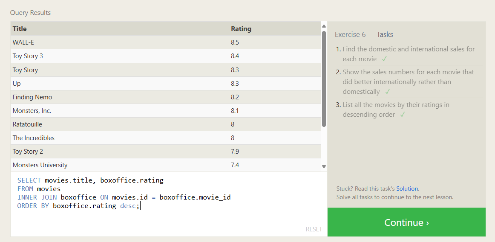
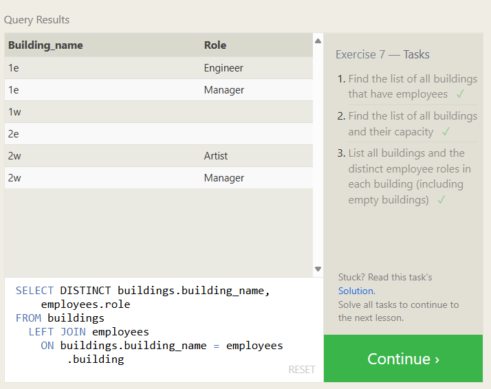
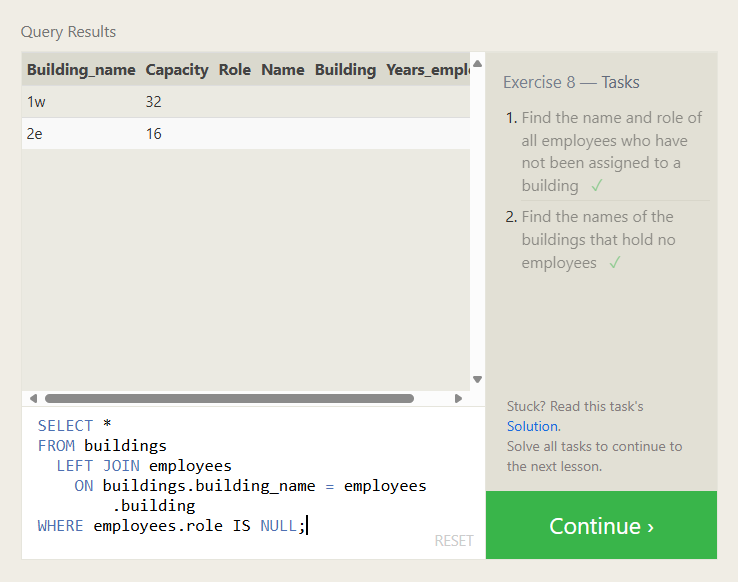
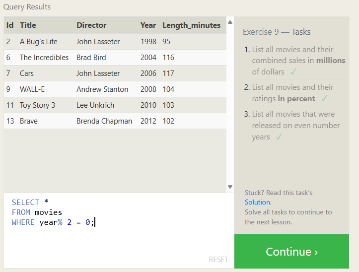
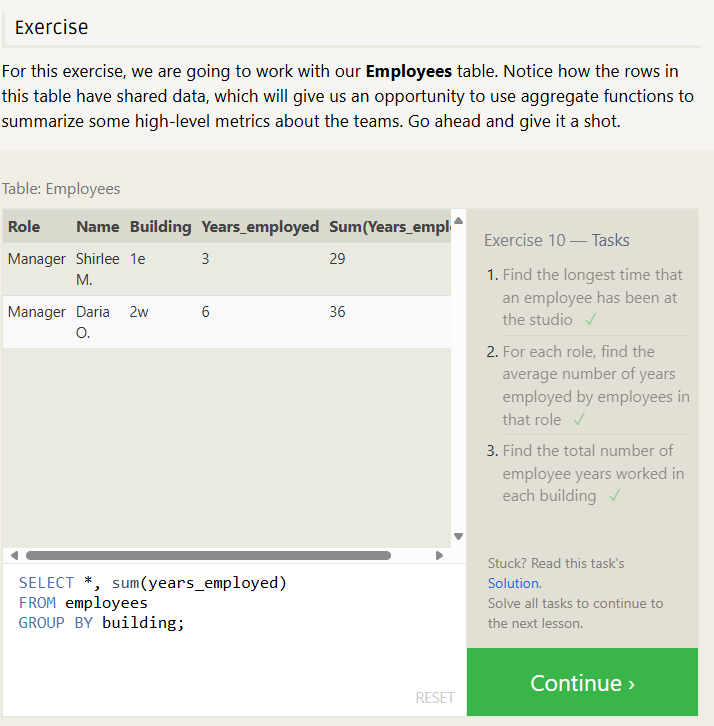
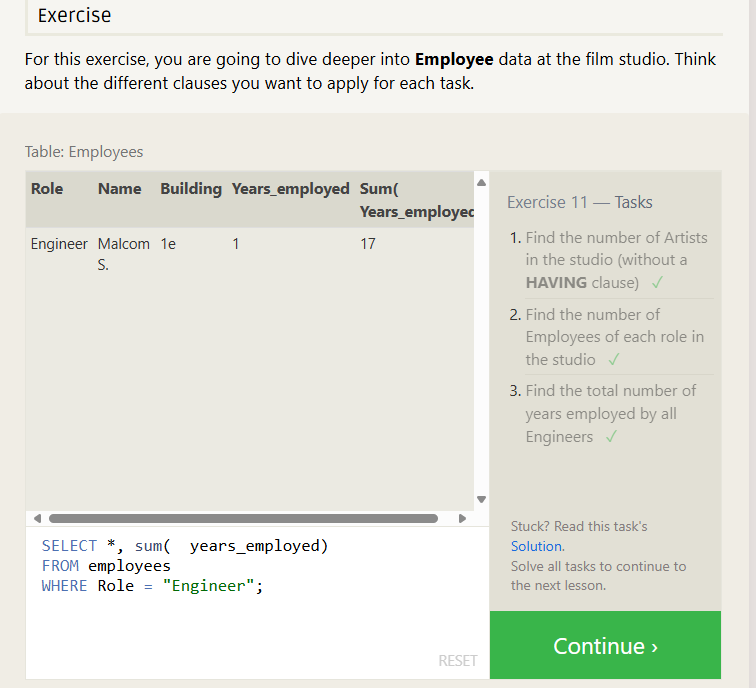
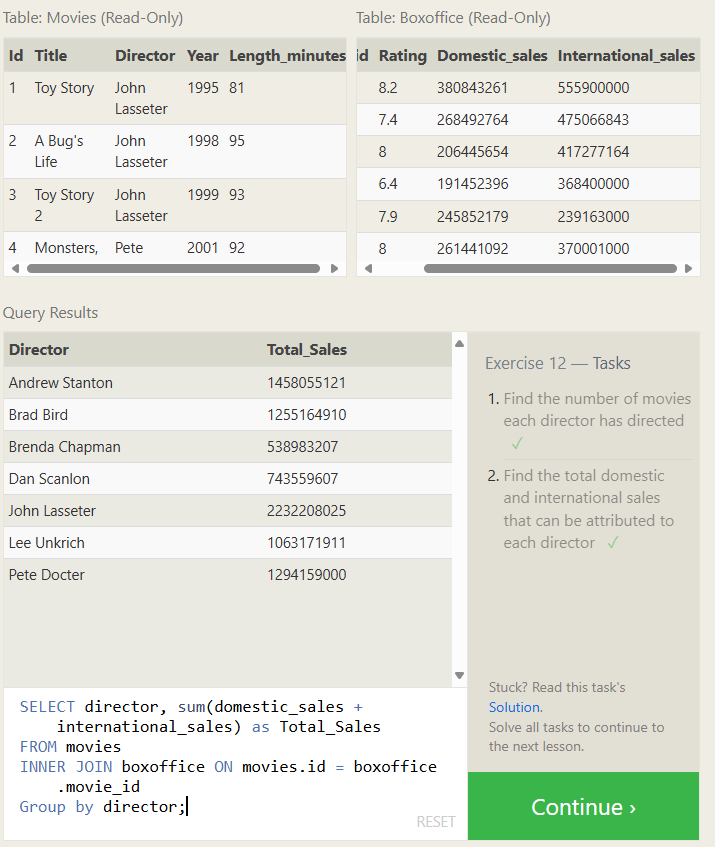
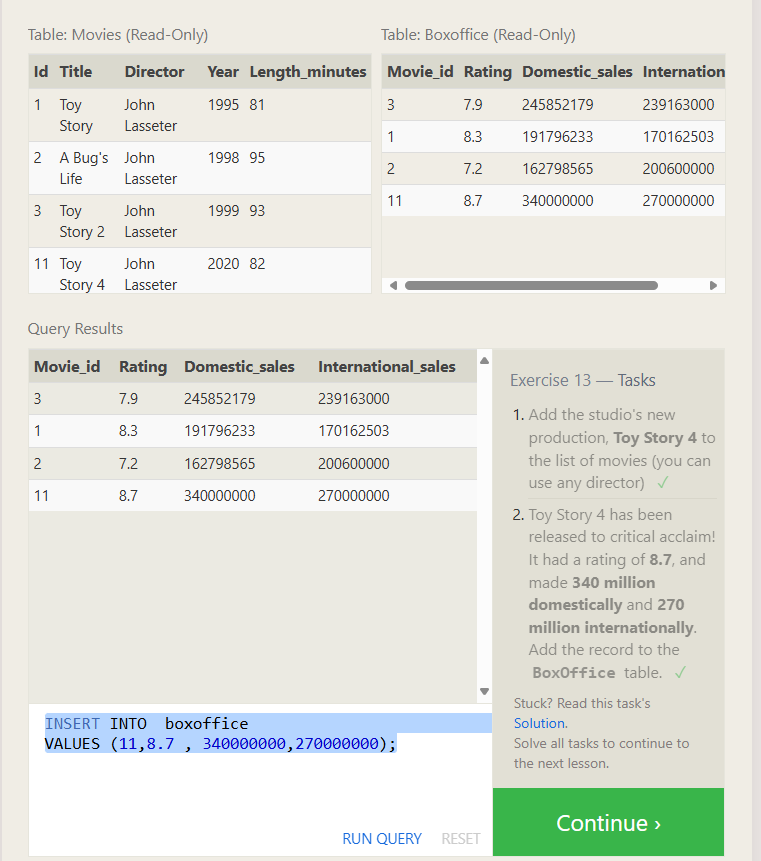

# Exercise 6 — Tasks

6.1. Find the domestic and international sales for each movie

```sql
SELECT title, domestic_sales, international_sales
FROM movies
  JOIN boxoffice
    ON movies.id = boxoffice.movie_id;
```

6.2. Show the sales numbers for each movie that did better internationally rather than domestically

```sql
SELECT movies.title, boxoffice.domestic_sales, boxoffice.international_sales
FROM movies
INNER JOIN boxoffice ON movies.id = boxoffice.movie_id
WHERE boxoffice.international_sales > boxoffice.domestic_sales;
```

6.3. List all the movies by their ratings in descending order

```sql
SELECT movies.title, boxoffice.rating
FROM movies
INNER JOIN boxoffice ON movies.id = boxoffice.movie_id
ORDER BY boxoffice.rating desc;
```



## Exercise 7 — Tasks

Find the list of all buildings that have employees ```sql
SELECT DISTINCT building FROM employees;

````
Find the list of all buildings and their capacity
```sql
SELECT building_name,capacity
FROM buildings;
````

List all buildings and the distinct employee roles in each building (including empty buildings)

```sql
SELECT DISTINCT buildings.building_name, employees.role
FROM buildings
  LEFT JOIN employees
    ON buildings.building_name = employees.building
```



# Exercise 8 — Tasks

Find the name and role of all employees who have not been assigned to a building

```sql
SELECT *
FROM employees
WHERE building is Null;
```

Find the names of the buildings that hold no employees

```sql
years_employed
```



# Exercise 9 — Tasks

List all movies and their combined sales in millions of dollars

```sql
SELECT title, (domestic_sales +	international_sales)/1000000 as Combined_Sales
FROM movies
INNER JOIN boxoffice ON movies.id = boxoffice.movie_id;
```

List all movies and their ratings in percent

```sql
SELECT title, boxoffice .rating*10 as rating_percent
FROM movies
INNER JOIN boxoffice ON movies.id = boxoffice.movie_id;
```

List all movies that were released on even number years

```sql
SELECT *
FROM movies
WHERE year% 2 = 0;
```



# Exercise 10 — Tasks

Find the longest time that an employee has been at the studio

```sql
SELECT *, max(years_employed)
FROM employees;
```

For each role, find the average number of years employed by employees in that role

```sql
SELECT *, avg(years_employed)
FROM employees
GROUP BY Role;
```

Find the total number of employee years worked in each building

```sql
SELECT *, sum(years_employed)
FROM employees
GROUP BY building;
```



# Exercise 11 — Tasks

Find the number of Artists in the studio (without a HAVING clause)

```sql
SELECT role , count(Role)
FROM employees
WHERE Role = "Artist";
```

Find the number of Employees of each role in the studio

```sql
SELECT * , count(name)
FROM employees
Group by Role;
```

Find the total number of years employed by all Engineers

```sql
SELECT years_employed, sum(	years_employed)
FROM employees
WHERE Role = "Engineer";
```



# Exercise 12 — Tasks

Find the number of movies each director has directed

```sql
SELECT director, count(title)
FROM movies
Group by director;
```

Find the total domestic and international sales that can be attributed to each director

```sql
SELECT director, sum(domestic_sales + international_sales) as Total_Sales
FROM movies
INNER JOIN boxoffice ON movies.id = boxoffice.movie_id
Group by director;
```



# Exercise 13 — Tasks

Add the studio's new production, Toy Story 4 to the list of movies (you can use any director)

```sql
  INSERT INTO movies
VALUES (11,"Toy Story 4" , "John Lasseter",2020,82);

```

Toy Story 4 has been released to critical acclaim! It had a rating of 8.7, and made 340 million domestically and 270 million internationally. Add the record to the BoxOffice table.

```sql
INSERT INTO  boxoffice
VALUES (11,8.7 , 340000000,270000000);
```



Exercise 14 — Tasks
The director for A Bug's Life is incorrect, it was actually directed by John Lasseter
The year that Toy Story 2 was released is incorrect, it was actually released in 1999
Both the title and director for Toy Story 8 is incorrect! The title should be "Toy Story 3" and it was directed by Lee Unkrich

```sql

```
