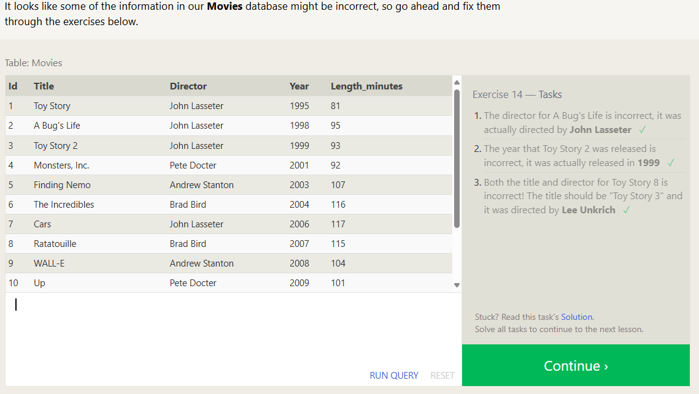
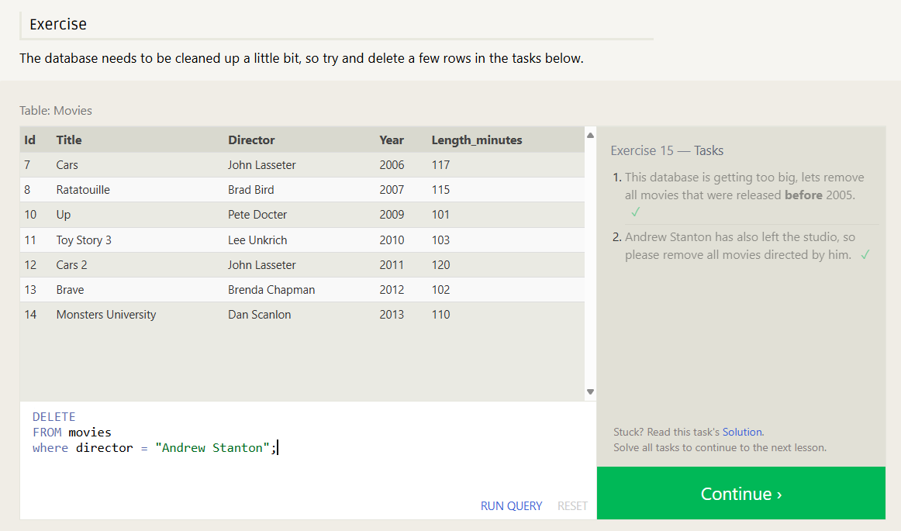

# Exercise 14 — Tasks

1. The director for A Bug's Life is incorrect, it was actually directed by John Lasseter

```sql
SELECT *
FROM movies
WHERE id=2;

UPDATE movies
SET director = "John Lasseter"
WHERE id=2;
```

2. The year that Toy Story 2 was released is incorrect, it was actually released in 1999

```sql
SELECT title,year
FROM movies
WHERE title ="Toy Story 2";

UPDATE movies
SET year = "1999"
WHERE title ="Toy Story 2";
```

3. Both the title and director for Toy Story 8 is incorrect! The title should be "Toy Story 3" and it was directed by Lee Unkrich

```sql
SELECT title,director
FROM movies
WHERE title ="Toy Story 8";

UPDATE movies
SET title = 'Toy Story 3', director = 'Lee Unkrich'
WHERE title = 'Toy Story 8';
```



# Exercise 15 — Tasks

1. This database is getting too big, lets remove all movies that were released before 2005.

```sql
SELECT *
FROM movies
WHERE year < "2005";

DELETE FROM movies
where year < 2005;
```

2. Andrew Stanton has also left the studio, so please remove all movies directed by him.

```sql
SELECT *
FROM movies
WHERE director = "Andrew Stanton";

DELETE
FROM movies
where director = "Andrew Stanton";
```



# Exercise 16 — Tasks

1. Create a new table named Database with the following columns:
   - Name A string (text) describing the name of the database
   - Version A number (floating point) of the latest version of this database
   - Download_count An integer count of the number of times this database was downloaded

This table has no constraints.

```sql
CREATE TABLE database (
    Name TEXT,
    Version FLOAT,
    Download_count INTEGER
);
```

# Exercise 17 — Tasks

Add a column named Aspect_ratio with a FLOAT data type to store the aspect-ratio each movie was released in.
Add another column named Language with a TEXT data type to store the language that the movie was released in. Ensure that the default for this language is English.
